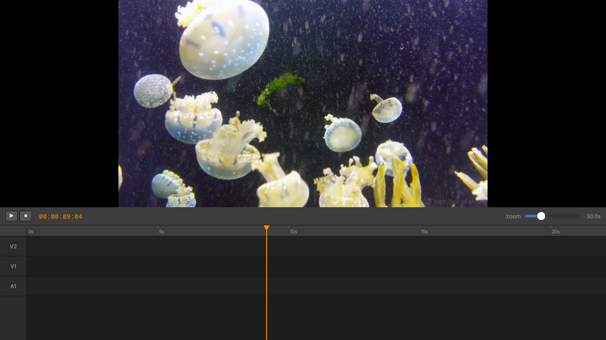

# Broadwell Video

A hardware-accelerated video editor built around one specific machine: an Intel
HD Graphics 5500 (Broadwell GT2, Gen8, 24 EU, 15 W) driving a 1366×768 laptop
panel on CachyOS with KWin on Wayland.

Svelte 5 front end, Rust back end, Tauri v2 IPC, and a native wgpu surface
composited as a Wayland *subsurface* inside the Tauri window — one window, zero
copy, no X11.



The screenshot is the real thing: 1080p H.264 at source frame rate in the top
pane, Blender-styled timeline in the bottom 300 px, play/pause/seek/scrub over
Tauri IPC. The black bars either side of the video are the letterbox working —
16:9 video in a 2.4:1 pane.

## The machine

Every design decision below follows from these constraints. None of them are
negotiable on this hardware.

| | |
|---|---|
| iGPU | Intel HD Graphics 5500 (Broadwell GT2, Gen8, 24 EU, 900 MHz, 15 W PL1) |
| Memory | 12 GiB DDR3L-1600, asymmetric 8 GiB (2R) + 4 GiB (1R), ~15 GB/s effective |
| Display | 1366×768 laptop panel, 60 Hz, Wayland + KWin |
| Vulkan | API 1.3 via **HasVK** (Mesa's trimmed Gen7/8 driver), not ANV |
| Missing | no bindless descriptor indexing, one queue family only, no ASTC HDR |
| Present | `VK_KHR_timeline_semaphore`, `sync2`, `buffer_device_address`, `external_memory_dma_buf`, `image_drm_format_modifier`, `shaderFloat16`, `shaderInt16`, `sampler_ycbcr_conversion` |
| VA-API | **i965** driver, H.264 decode and encode only — no H.265, VP9 or AV1 |
| Broken | the VPP block corrupts 1080p60 incompressible content; `scale_vaapi` is banned from the pipeline |

The i965 VA-API driver is a hard requirement: this GPU generation predates iHD.
Installing `intel-media-driver` will not help and `libva-intel-driver` must be
present.

## Architecture

```
H.264 file
  │
  ├─ i965 VA-API decode ─────────► NV12 surface, in the video engine's pool
  │
  ├─ av_hwframe_map ─────────────► DRM_PRIME, two layers
  │      layer[0] Y  : DRM_FORMAT_R8   pitch = width
  │      layer[1] UV : DRM_FORMAT_GR88 pitch = width, offset ≈ width × height
  │
  ├─ grafting::VulkanDmaBufImport ─► wgpu::Texture<R8Unorm> + <Rg8Unorm>
  │      one dup()'d fd per plane keeps the GEM object alive; a fence waits on
  │      the foreign (video engine) queue before the first use
  │
  ├─ grade.wgsl ─────────────────► BT.709 YUV→RGB, saturation, gamma
  │      compute pass, writes Rgba8Unorm
  │
  ├─ blit.wgsl ──────────────────► aspect-preserving letterbox → surface
  │
  └─ present ────────────────────► wl_subsurface, below the webview
```

### The Wayland subsurface is the centrepiece

The wgpu surface is a `wl_subsurface` of GTK's top-level `wl_surface`, created
from the same `wl_display` GDK is already using (`Backend::from_foreign_display`
— no second connection). It is placed **below** the parent so the webview draws
on top, given an **empty input region** so every click and drag reaches the
webview, and set to **desync** so its commits do not wait on the parent.

Tauri's `build_as_child` needs an X11 window handle and does not work on
Wayland, and a second top-level window is not the same thing. This is how
Firefox, Chrome and Slint do it. See
`editor/src-tauri/src/wayland_subsurface.rs`.

### Scrubbing

The event loop runs at the video's frame rate during playback, but switches to
display rate while a seek is outstanding or was serviced in the last 400 ms —
pacing a scrub to 29.97 fps caps updates at 30/s, which is what made dragging
feel like single-digit refresh. Pace selection is `wants_display_rate()` in
`core/src/renderer.rs`, unit tested including the case that matters most: a
landed chase must hand pacing back to the video, or the rest of the window
would fast-forward the film.

Inside a frame, the seek and the decode share a 6 ms budget and whatever the
decoder has reached is presented, so a drag never blocks until a seek lands on
its exact frame. The image trails the pointer slightly and catches up over the
next iteration or two. The stats line reports `presents/s`, `seeks/s` and
`chase ms` (how far the displayed frame is from the playhead) so this is
measurable rather than a matter of opinion.

## The vendored `grafting` patch

`vendor/grafting/` is a copy of `grafting` 0.6.0 with three changes in
`src/vulkan_dmabuf.rs`, all required to import NV12 planes directly:

1. `map_format` accepts `R8Unorm` and `Rg8Unorm`.
2. `map_drm_format` accepts `DRM_FORMAT_R8` (`0x20203852`) and `DRM_FORMAT_GR88`
   (`0x38385247`).
3. `acquire_from_foreign_queue` uses a fence instead of `vkQueueWaitIdle`. The
   queue-wide idle blocked on the compositor's in-flight submissions and cost
   about 1 ms of latency per frame.

`[patch.crates-io]` is declared at the **workspace root** on purpose: Cargo
ignores `[patch]` in dependencies, which is why this is a workspace at all.

## Measured performance

1080p H.264, this machine, debug-ish builds unless noted:

| Stage | Cost |
|---|---|
| VA-API decode | 0.2–0.4 ms |
| Import + acquire barrier (cache hit) | 2.0–2.8 ms |
| Grade compute | ~0.5 ms |
| Blit + present to subsurface | ~6 ms |
| **Total per frame** | **~9.4 ms** |

Export throughput, hardware `h264_vaapi` (CQP 22, no B-frames, GOP 60):

| Content | Rate |
|---|---|
| 1080p60 noise | 75 fps |
| 1080p30 real content | 77 fps |
| 720p30 | 126 fps |

Effect budget, measured by chaining no-op compute passes:

| Chained passes | Pipeline |
|---|---|
| 0 | 167 fps |
| 1 | 112 fps |
| 2 | 101 fps |
| 4 | 86 fps |
| 8 | 54 fps |

Marginal cost is ~1.5 ms per chained full-frame pass. Point operations (colour
grade, contrast, curves, LUT, vignette, grain, chroma key) fuse into
`grade.wgsl` for roughly +0.05 ms each; only spatial effects (blur, sharpen,
warp) need their own passes.

## Status

| | |
|---|---|
| 1080p H.264 playback at source frame rate | works |
| Aspect-correct letterbox, including non-square pixels | works |
| Play / pause / seek / scrub over Tauri IPC | works |
| Hardware `h264_vaapi` export | **unreliable on this driver — see below** |
| Software export through libx264 | correct, and the default |
| Scrubbing at display rate | in progress |
| Audio | not started |
| Effect chain | not started |
| Timeline clips | not started — the tracks are static rectangles |

### Bucket list

Procedural, Motion Canvas-style clips (code that computes values from time,
animated layouts, image animations) are not part of this MVP. Two decisions keep
the door open: a clip's source should be an enum (`MediaFile | Generated`) rather
than "clip = video file", and effect parameters should be evaluated as functions
of timeline time rather than constants. Rendering is the easy part on this
hardware — procedural scenes involve no video decode at all.

## Building

```fish
git clone https://github.com/reold/broadwell-video
cd broadwell-video

# Arch / CachyOS
sudo pacman -S --needed base-devel rustup bun ffmpeg mesa vulkan-intel \
    libva-intel-driver webkit2gtk-4.1 gtk3 libsoup3

cd editor
bun install
tauri dev
```

Built against: Mesa 26.2.3, vulkan-intel 26.2.3, libva 2.24.1,
libva-intel-driver 2.4.5, FFmpeg 9.0.2 (libavcodec 63.1.102), webkit2gtk-4.1
2.52.6, GTK 3.24.52, Bun 1.4.2, Rust 1.97 (edition 2024), wgpu 30.0.1,
Tauri 2.12, Svelte 5.56, Vite 8.3.

The clip opened at startup comes from `HWA_VIDEO`, defaulting to
`~/Downloads/jellyfish-15-mbps-hd-h264.mkv`.

## Tests

```fish
cargo test -p hwa-core                      # everything, needs /dev/dri for 5 of them
HWA_ALLOW_NO_GPU=1 cargo test -p hwa-core   # acknowledge a machine with no GPU
bun run --cwd editor check                  # svelte-check
```

The GPU tests deliberately **fail** rather than skip silently when no Vulkan
adapter is present, because a skipped test and a passing test look identical in
the summary. `HWA_ALLOW_NO_GPU=1` is the explicit opt-out.

- `core/tests/letterbox.rs` — renders through the real pipeline into an
  offscreen target and asserts the exact bar geometry: letterbox, pillarbox,
  exact match, 1080p in the 1440×600 pane (video at columns 187–1252), and
  anamorphic 720×480 with SAR 32:27 producing identical geometry to 1080p.
- `core/tests/aspect.rs` — the sample-aspect-ratio maths, including the NTSC and
  PAL widescreen cases and the fallback when a stream declares no SAR.
- `core/tests/shader_validation.rs` — every WGSL file parsed and validated with
  the same naga front end `wgpu` uses.
- `core/src/renderer.rs` — loop pacing rules, including the playback
  fast-forward guard.

## Layout

```
core/                     hwa-core: the shared pipeline
  src/renderer.rs           decode → import → grade → blit, loop pacing
  src/gpu.rs                pipelines, bind group layouts, letterbox uniform
  src/ffmpeg.rs             decode handles, seeking, SAR, display aspect
  src/export.rs             FFmpeg child process, h264_vaapi
  src/*.wgsl                grade, packed export planes, letterbox blit
preview/                  hwa-preview: standalone winit + wgpu player and exporter
editor/                   hwa-editor: the Tauri app
  src/routes/+page.svelte   the whole UI
  src-tauri/src/lib.rs      commands, render loop, timing
  src-tauri/src/wayland_subsurface.rs
vendor/grafting/          patched grafting 0.6.0
docs/                     screenshots
archive/wgpu-probe/       dead prototype, do not build
```

## IPC surface

Commands: `get_state`, `toggle_play`, `set_paused`, `seek_to`, `log_msg`,
`greet`, `default_export_path`, `start_export`, `cancel_export`.
Events: `playhead_update` carrying `{playing, position_ms, duration_ms, fps}`,
and `export_progress` carrying `{stage, frames_done, frames_total, fps, output,
error}`. Shared state is `Arc<Mutex<EditorState>>`, registered with Tauri via
`.manage()`.

## Export

The Export button hands the render loop to ffmpeg: each iteration decodes a
frame, grades it through the packed export shaders (`grade_y.wgsl`,
`grade_uv.wgsl` write 4 Y samples and 2 UV pairs per `R32Uint` texel, so the
readback is a `memcpy` per plane), and pipes packed NV12 into a child process.

The output path defaults to `<clip>-export.mp4` beside the source, so the button
works without typing anything and cannot overwrite the original. The preview
pane holds its last frame while an export runs; export takes priority over
preview pacing, and back-pressure comes from ffmpeg's pipe rather than a sleep.

### The hardware encoder on this machine cannot be trusted

This is the one part of the pipeline the hardware does not deliver, and it took
a frame count to see it. The original throughput figure — 75–77 fps for 1080p —
was measured and is real:

```
proc 3.5 ms   rb 6.5 ms   pipe 2.6 ms   →  13 ms/frame
```

Less than 3 ms of that is the encoder waiting, so the encoder was never the
throughput limit. What was never checked is whether the output was complete.
It was not.

| | written | packets muxed | decodable pictures |
|---|---|---|---|
| `hwa-preview` export, 1080p real content | 899 | 872 | **817** |
| editor export, same file | 900 | 888 | **543** |
| editor export, second attempt | 900 | 900 | 900 |
| no decoder, no wgpu, no readback — 899 synthetic black frames straight into ffmpeg | 899 | 898 | **840** |

The last row is the one that matters. With nothing of ours involved — no
decoder, no grade, no readback, no pipeline — the encoder still dropped an input
frame, and because `-bf 0` leaves no B-frames to reorder, every later picture in
that GOP referenced a frame that never arrived and the decoder emitted nothing
for them. **One dropped frame cost 58 pictures.**

It also aborts outright. One run died on

```
i965_drv_video.c:3433: i965_MapBuffer2:
Assertion `coded_buffer_segment->base.buf' failed.
```

which leaves an mp4 with no moov atom: an unplayable file rather than a lossy
one. The drops are intermittent — one batch of nine runs at `-g 60` was clean
eight times — but they never disappear.

### What it means, and what the defaults are

Broadwell has no VDENC and no HuC firmware: Gen8 uses the PAK + shader encoder,
which runs motion estimation and macroblock kernels on the same 24 EUs as
everything else, under a 15 W envelope, through a driver Intel archived in
October 2024. Skylake and later have the low-power fixed-function encoder;
Broadwell does not, and Intel's current iHD driver lists AVC *encode* as a
Broxton-and-later feature, with Broadwell supported for decode only.

So `libx264` is the default and `HWA_EXPORT_ENCODER=vaapi` opts back in. A fast
broken export is worth less than a slow correct one.

Measured end to end on the Jellyfish clip, 30 s of 1080p30, through this
pipeline:

| encoder | fps | frames written → decodable | size |
|---|---|---|---|
| `h264_vaapi` | 26.8 | 899 → **817** | 65 MB |
| libx264 `ultrafast` | **52.0** | 899 → **899** | 90 MB |
| libx264 `veryfast` | 21.9 | 899 → **899** | 55 MB |
| libx264 `medium` | 6.9 | 899 → **899** | 56 MB |

The software encoder is not a consolation prize here: at `ultrafast` it is
**twice as fast as the hardware encoder** on this machine, and it is the only
one that produces a complete file. Two cores are enough for 1080p30 when the
preset is chosen for throughput rather than file size.

| variable | default | why |
|---|---|---|
| `HWA_EXPORT_ENCODER` | `x264` | the hardware encoder loses frames and can abort |
| `HWA_EXPORT_X264_PRESET` | `ultrafast` | 52 fps measured; `veryfast`/`medium` trade speed for size |
| `HWA_EXPORT_GOP` | `30` | with `-bf 0` a drop costs up to one GOP; measured, 186 pictures lost at `-g 30` against 45 at `-g 15` |

Every export is now **verified rather than assumed**: after ffmpeg exits,
`ffprobe -count_frames` counts what is actually in the file, and a short count
prints a warning naming the cause. Timing an export and calling it done is the
mistake that hid this for a whole session.

### The lesson worth keeping

`proc 3.5 + rb 6.5 + pipe 2.6` was a true measurement of throughput on a stream
that was quietly losing 27% of its pictures. **A throughput number and a
correctness number are different claims, and the encoder here only ever
satisfied the first.** Pair them in the same run.

## Gotchas worth knowing

- `scale_vaapi` corrupts 1080p60 incompressible content on i965. NV12 is
  imported as two planes instead.
- `av_seek_frame(BACKWARD)` lands on the previous keyframe, so frames are
  pruned forward until `PTS >= target`.
- `av_hwframe_map` must run on every frame even on a texture-cache hit: it is
  what triggers the foreign-queue acquire barrier. The imported textures are
  cached on the `fstat` identity of the underlying GEM object; decoded
  `AVFrame`s are never held, or the VA-API pool starves.
- `R8Unorm`/`Rg8Unorm` are not safe as *storage* textures on HasVK. The export
  path packs Y and UV into `R32Uint` so readback is a `memcpy`.
- wgpu 30 renames that are easy to trip over: `PollType::Wait` instead of
  `Maintain::Wait`, `queue.present(texture)`, `CurrentSurfaceTexture` instead of
  `SurfaceError`, `color_space` on `SurfaceConfiguration`,
  `apply_limit_buckets` on `RequestAdapterOptions`.

## License

MPL-2.0. See [LICENSE](LICENSE).

## Acknowledgements

[grafting](https://github.com/merely-made/wgpu-graft) for Vulkan↔wgpu dmabuf
interop, [wgpu](https://wgpu.rs), FFmpeg, and the Blender dark palette the UI
borrows its colours from.
